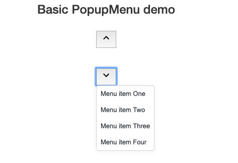

# popup-menu

Simple, lightweight, and easy-to-use popup menu UI widget for web applications.



## Viewing Demo Application

First, run `npm install` to install all development dependencies. Then run `npm start` to start the demo application in the default browser.

## Using PopupMenu in your application

Check <a href="https://github.com/ui-widgets-js/popup-menu/blob/master/demo/index.js">demo/index.js</a> for the full example code.

```
  import PopupMenu, { PopupMenuItem, PopupMenuPosition } from './popup-menu.js';

  // This example shows how to display PopupMenu under the specific button
  const myButton = document.getElementById('myButton');
  const itemList = [
    new PopupMenuItem(1, 'Menu item 1'),
    new PopupMenuItem(2, 'Menu item 2'),
    new PopupMenuItem(3, 'Menu item 3')
  ];
  const position = PopupMenuPosition.alignBottomLeft(myButton);
  const selectedId = await PopupMenu.show(itemList, position);
```

## License

<a href="https://github.com/ui-widgets-js/popup-menu/blob/master/LICENSE">MIT License</a>